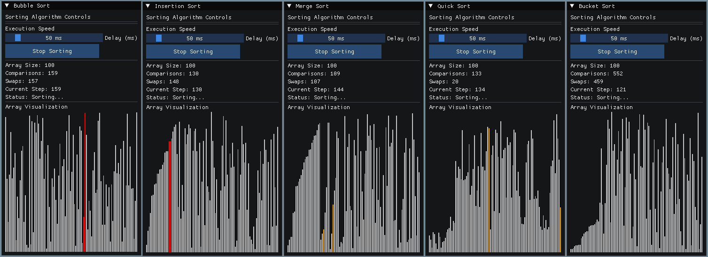

# Algorithm Visualizer

## Features

- **Multiple Sorting Algorithms**: Visualize and compare Bubble Sort, Insertion Sort, Merge Sort, Quick Sort, and Bucket Sort
- **Real-time Visualization**: Watch algorithms in action with color-coded elements
- **Step-by-Step Mode**: Control the execution manually to understand each step
- **Step Backward**: Unique feature to go back in time and review previous steps
- **Statistics Tracking**: Monitor comparisons, swaps, and steps for algorithm analysis
- **Adjustable Speed**: Control the visualization speed for better understanding
- **Customizable Array Size**: Test algorithms with different data set sizes
- **Random Array Generation**: Create new test cases with a single click

## Implemented Algorithms

| Algorithm | Average Time Complexity | Space Complexity | Stability |
|-----------|-------------------------|------------------|------------|
| Bubble Sort | O(n²) | O(1) | Stable |
| Insertion Sort | O(n²) | O(1) | Stable |
| Merge Sort | O(n log n) | O(n) | Stable |
| Quick Sort | O(n log n) | O(log n) | Unstable |
| Bucket Sort | O(n+k) | O(n+k) | Stable |

## Installation

### Prerequisites

- Visual Studio 2019 or newer
- C++17 compatible compiler
- GLFW and ImGui (included in the vendor directory)

### Building from Source

1. Clone the repository:

2. Open the solution file `AlgorithmVisualizer.sln` in Visual Studio

3. Build the solution (F7 or Ctrl+Shift+B)

4. Run the application (F5)

## Usage

### Basic Controls

- **Array Size Slider**: Adjust the number of elements in the array
- **Generate New Array**: Create a new random array
- **Start/Stop Sorting**: Begin or pause the visualization
- **Step-by-Step Mode**: Toggle between continuous and manual stepping
- **Step Forward/Backward**: Navigate through algorithm steps manually
- **Speed Control**: Adjust the delay between steps

### Visualization Color Guide

- **Gray**: Default element state
- **Orange**: Elements being compared
- **Red**: Elements being swapped
- **Green**: Sorted array (when algorithm completes)

## How It Works

The visualizer uses the following components:

- **Algorithm Classes**: Each sorting algorithm is implemented as a class derived from the base `Algorithm` class
- **VisualizationData**: Manages the array elements and their visual states
- **SortingStats**: Tracks algorithm performance metrics and execution state
- **Renderer**: Handles the graphical representation using ImGui and OpenGL
- **ArrayGenerator**: Creates random arrays for testing

## Acknowledgments

- [Dear ImGui](https://github.com/ocornut/imgui) for the immediate mode GUI
- [GLFW](https://www.glfw.org/) for OpenGL context management